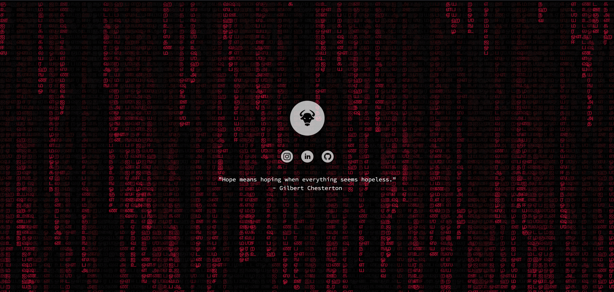
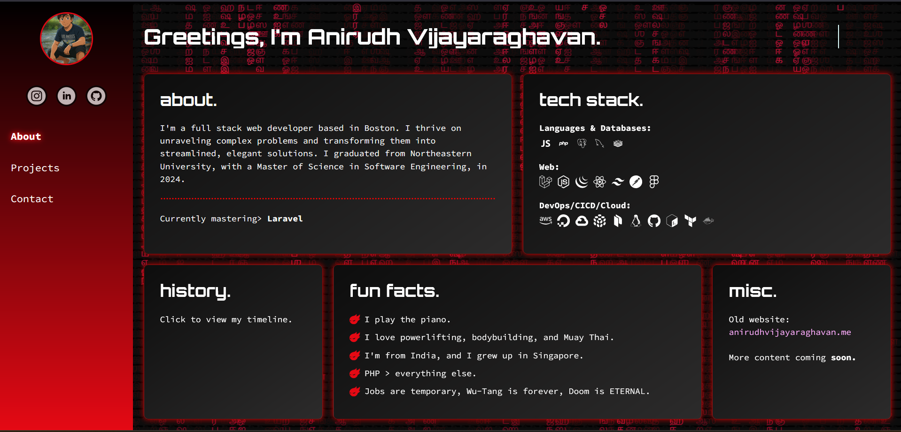

# Personal Portfolio

Check it out here: [anirudhvijay.xyz](https://anirudhvijay.xyz)


---

## About

**CyberPortfolio** is my personal portfolio built with React and Vite. This project is just a showcase of my work.

- **Vibe:** Matrix.
- **Technology:** React, Vite, JavaScript, CSS (with custom modals & neon accents).

---

## Features

- **Responsive Design:** Enjoy a seamless experience on mobile, tablet, and desktop.
- **Animated Cyber Effects:** Subtle animations inspired by the digital rain of the Matrix.
- **Interactive Sections:** Animated skill graphs, portfolio showcases, and contact form.

---

## Technologies Used

- **[React](https://reactjs.org)** – A JavaScript library for building user interfaces.
- **[Vite](https://vitejs.dev)** – Next Generation Frontend Tooling for lightning fast development.
- **CSS / Sass** – Custom styling to create that cyberpunk neon glow.
- **External Libraries:** GSAP for animations, Axios for API interactions.

---

## Getting Started

### Installation

1. **Clone the Repository:**

   ```bash
   git clone https://github.com/AnirudhVijayaraghavan/anirudhvijay.xyz.git
   cd *into the folder*
   npm i
   npm run build
   npm run dev
   
